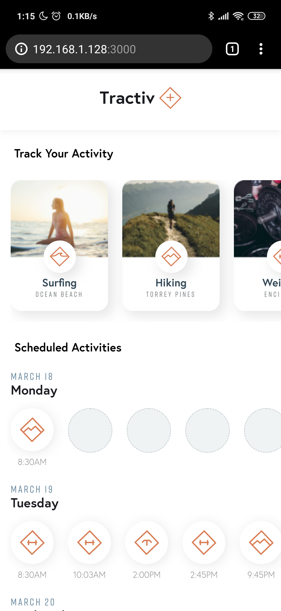
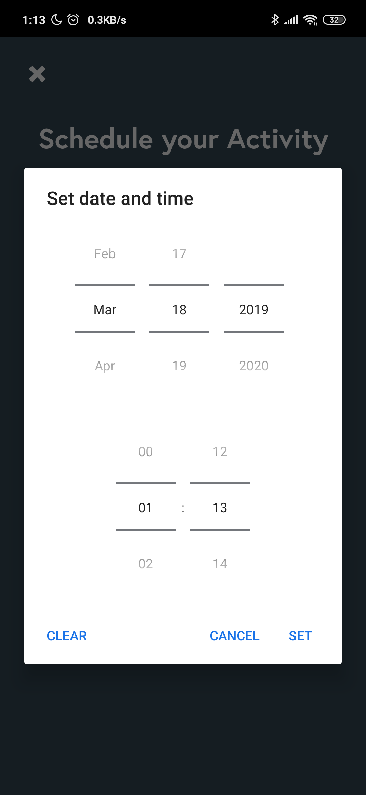
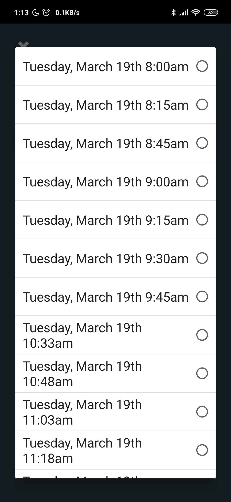
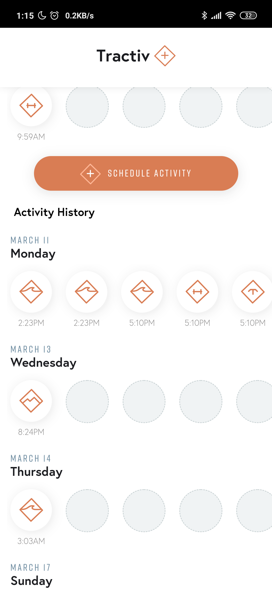

# Activity Tracker

## Setup backend

Install global package for serving simple backend : `yarn global add json-server`

## Install the dependencies

`yarn`

## Run local development

1. Start backend: `yarn mock-backend`

2. Start frontend: `yarn start`

## App Screenshots:

